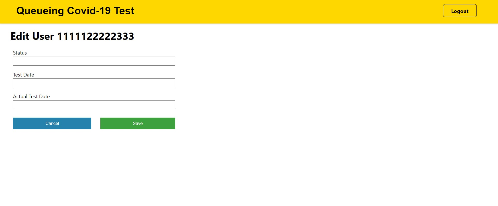

# Queueing COVID-19 test System
In order to understand how frontend and backend work together, I created this project which has both frontend and backend side separated from each other. 

Queueing COVID-19 Test System web application is created to manage COVID-19 test queue which include login, logout, show data and edit data features which users are divided into 2 categories: general user and admin. General user can see their profile and test status. In the other hand, Admin can edit all of the general user data.

## Technologies

## Features
- Login and logout with JWT token send from server to client back and forth
- Page navigation with react-router
- General users can see their data when they have already logged in.
- Admin users can see all general users data and edit their data.
- All data are stored in mySQL database which use xampp to create database connection.

## Pages
### Main Menu - has login and sign up button

### Login - authenticate with username and password

### General User profile - shows their profile

### Admin Account - show all general user profile and edit buttons

### Admin Edit User - edit user

